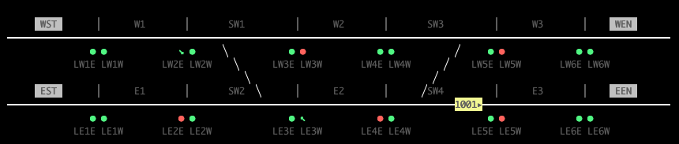

# Track2



A subway/metro simulation TUI built in TypeScript.

Track2 lets you define subway networks in `.map` files and watch trains run in a control-room-style terminal display.

## Quick Start

```bash
npm install
npm run dev -- maps/08-terminal.map
```
Try `maps/08-terminal.map` to see the new **terminal behavior** — trains arriving at a terminus pick the platform on the outbound-direction track (so they depart straight on the next run), and hold there for the configured `layover` rather than the regular station dwell.

## Development

```bash
npm run dev -- <mapfile>              # Run with tsx (dev)
npm run dev -- --debug <mapfile>      # Headless: dump train/switch state to stdout
npm run build                         # Compile TypeScript
npm start -- <mapfile>                # Run compiled version
```

## Project Structure

```
src/
  main.ts              # Entry point
  parser/              # .map file parser
  model/               # Track topology and state
  controller/          # Simulation engine
  view/                # TUI renderer
maps/                  # Example .map files
```

## Status

Phase 8 complete — terminal behavior. Platforms that share an abbreviation (e.g. `[STH-W]` and `[STH-E]`) are treated as platforms of one station, and trains arriving at a route's first or last station now select the platform on the track natural to the *reversed* direction so they depart straight on the next run. If that platform is occupied, the train falls back to the same-track platform (a deliberate misroute that the next terminus crossover will correct). Layover time (configurable per route via `layover:`, otherwise from `config.layover`, otherwise 60 seconds) replaces the normal station dwell at termini.

Route endpoints are currently required to be physical track termini. Mid-line turnbacks need explicit turnback or crossover support before they can be modeled safely.

Plain segment joins render visible boundary tick marks; stations and switches serve as their own boundaries.
